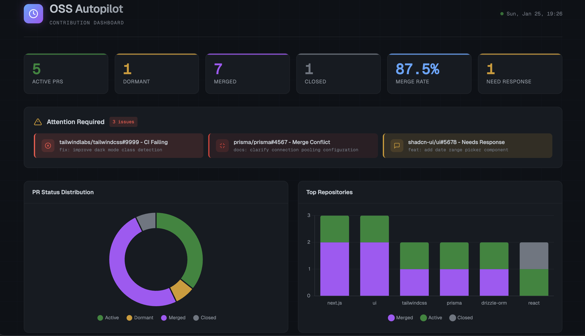

# OSS Autopilot

Discover issues worth contributing to, track your PRs across repos, and draft responses to maintainer feedback. An AI copilot for your open source journey.




## Quick Start

**Prerequisites:** [Claude Code](https://claude.ai/claude-code), Node.js 18+, and [GitHub CLI](https://cli.github.com/) (`gh auth login`).

**In Claude Code, run:**

```
/plugin marketplace add costajohnt/oss-autopilot
/plugin install oss-autopilot
```

Then run `/setup-oss` to configure your preferences. That's it.

---

## What It Does

Contributing to open source is rewarding but hard to sustain. PRs get lost, maintainer comments go unnoticed, and promising issues slip away.

**The problem:**
- You forget to check on PRs you submitted weeks ago
- Maintainer comments sit unanswered, PRs go stale
- You want to contribute more but don't know where to start
- Tracking multiple contributions across repos is tedious

**How OSS Autopilot helps:**
- **PR monitoring**: Checks all your open PRs for new comments, CI failures, merge conflicts
- **Smart response drafting**: Claude reads maintainer feedback and drafts responses for your approval
- **Adaptive issue discovery**: Finds issues matching your skills and learns from your contribution history
- **Repository scoring**: Tracks repo responsiveness and analyzes health before you contribute
- **Human-in-the-loop**: Claude never posts anything without your explicit approval

## Usage

Once installed, just run:

```
/oss
```

Claude will check your PRs and present actionable options:

```
📊 16 Active PRs | 3 need attention | Dashboard opened in browser

Which issues would you like to address?

1. [CI Failing] shadcn/ui#9263 - fix(docs): use yarn dlx for npx
2. [Merge Conflict] ink#861 - Fix emoji border alignment
3. [Needs Response] ink#858 - Remove create-ink-app from README
4. Address all issues above
5. Find new issues to work on
6. Done for now
```

### Available Commands

| Command | Description |
|---------|-------------|
| `/oss` | Check your PRs, see what needs attention, take action |
| `/setup-oss` | Configure preferences and import existing PRs |

### Specialized Agents

Claude automatically uses these agents based on context:

| Agent | Purpose |
|-------|---------|
| **pr-responder** | Drafts responses to maintainer feedback |
| **pr-health-checker** | Diagnoses CI failures, merge conflicts, stale reviews |
| **pr-compliance-checker** | Validates PRs against [opensource.guide](https://opensource.guide) best practices |
| **issue-scout** | Finds and vets new issues to work on |
| **repo-evaluator** | Analyzes repository health before contributing |
| **contribution-strategist** | Strategic advice for your OSS journey |

---

## Updating

OSS Autopilot can be updated directly from Claude Code:

```
/plugin update oss-autopilot
```

This pulls the latest version from the marketplace. Your configuration in `~/.oss-autopilot/` is preserved across updates.

To check your current version, look at `.claude-plugin/plugin.json` in the plugin directory.

See the [Changelog](CHANGELOG.md) for what's new in each release.

---

## How It Works

OSS Autopilot uses a hybrid architecture for reliability and speed:

```
┌─────────────────────────────────────────────────┐
│  Claude Code Plugin Layer                       │
│  - /oss and /setup-oss commands                 │
│  - Specialized agents for different tasks       │
│  - Natural language interface                   │
├─────────────────────────────────────────────────┤
│  TypeScript CLI (deterministic, fast)           │
│  - Syncs PR state from GitHub API               │
│  - Outputs structured JSON for Claude to parse  │
│  - Generates HTML dashboard                     │
├─────────────────────────────────────────────────┤
│  Core Logic (tested, type-safe)                 │
│  - State management                             │
│  - PR health monitoring                         │
│  - Capacity assessment                          │
└─────────────────────────────────────────────────┘
```

**Why this architecture?**
- **Reliability**: Deterministic TypeScript code handles GitHub API calls and state management
- **Speed**: CLI operations complete in seconds, not minutes
- **Testability**: Core logic has unit tests, plugin layer focuses on UX
- **Transparency**: JSON output means you can see exactly what data Claude receives

---

## Configuration

Settings are stored in `~/.oss-autopilot/state.json`:

| Setting | Default | Description |
|---------|---------|-------------|
| `githubUsername` | (detected) | Your GitHub username |
| `maxActivePRs` | 10 | Capacity limit before suggesting focus |
| `dormantDays` | 30 | Days until PR marked dormant |
| `approachingDormantDays` | 14 | Days until dormancy warning |

---

## Alternative Installation

### For development/testing (per-session)

```bash
git clone https://github.com/costajohnt/oss-autopilot.git
claude --plugin-dir ./oss-autopilot
```

### Prerequisites

```bash
# Install GitHub CLI from https://cli.github.com/
gh auth login
```

The CLI auto-builds on first run (requires Node.js 18+ and npm).

---

## Requirements

- [Claude Code](https://claude.ai/claude-code) (latest version)
- Node.js 18+ (for running the bundled CLI)
- GitHub CLI (`gh`): for GitHub API access

---

## Tips for Effective Use

**Start small:** Set `maxActivePRs` to 3-5 when starting out. Better to maintain fewer PRs actively than let many go stale.

**Check in regularly:** Run `/oss` every few days. Stale PRs are hard to revive.

**Trust but verify:** Claude's draft responses are good starting points, but review them: you know the technical context.

**Use dormant warnings:** When a PR approaches your threshold, send a polite follow-up. Maintainers are busy.

**Evaluate repos first:** Before claiming an issue, let the repo-evaluator check if the project is actively maintained.

---

## Troubleshooting

### GitHub CLI authentication errors

```
Error: gh: command not found
```

Install [GitHub CLI](https://cli.github.com/) and authenticate:

```bash
brew install gh    # macOS
gh auth login
```

### Build fails on first run

The CLI bundles automatically on first use. If it fails:

```bash
cd ~/.claude/plugins/oss-autopilot   # or your plugin directory
npm install
npm run bundle
```

### Dashboard doesn't open

The dashboard is generated at `~/.oss-autopilot/dashboard.html`. If it doesn't open automatically, open the file manually in your browser.

### PRs not showing up

- Run `/setup-oss` to ensure your GitHub username is configured
- Check that `gh auth status` shows you're authenticated
- The plugin only tracks PRs you authored — it won't show PRs from other users

---

## FAQ

**Does Claude post comments or push code automatically?**
No. OSS Autopilot is fully human-in-the-loop. Claude drafts responses and suggests actions, but nothing is posted to GitHub without your explicit approval.

**Where is my data stored?**
All data is stored locally in `~/.oss-autopilot/`. Nothing is sent to external servers beyond the GitHub API calls needed to fetch your PR data.

**Does it work with private repositories?**
Yes, as long as your GitHub CLI (`gh`) has access to those repos. The plugin uses your existing `gh` authentication.

**Can I use this without the Claude Code plugin system?**
The CLI can run standalone (`node dist/cli.bundle.cjs daily --json`), but it's designed to work with Claude Code for the best experience.

---

## Changelog

See [CHANGELOG.md](CHANGELOG.md) for a detailed history of changes.

---

## Contributing

Contributions welcome! See [CONTRIBUTING.md](CONTRIBUTING.md) for setup instructions and guidelines.

---

## License

MIT
