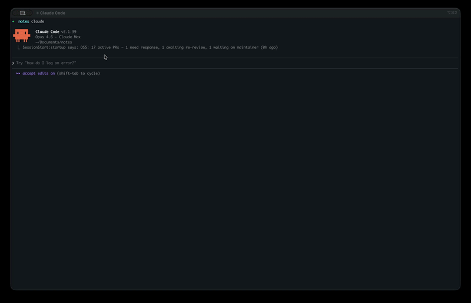
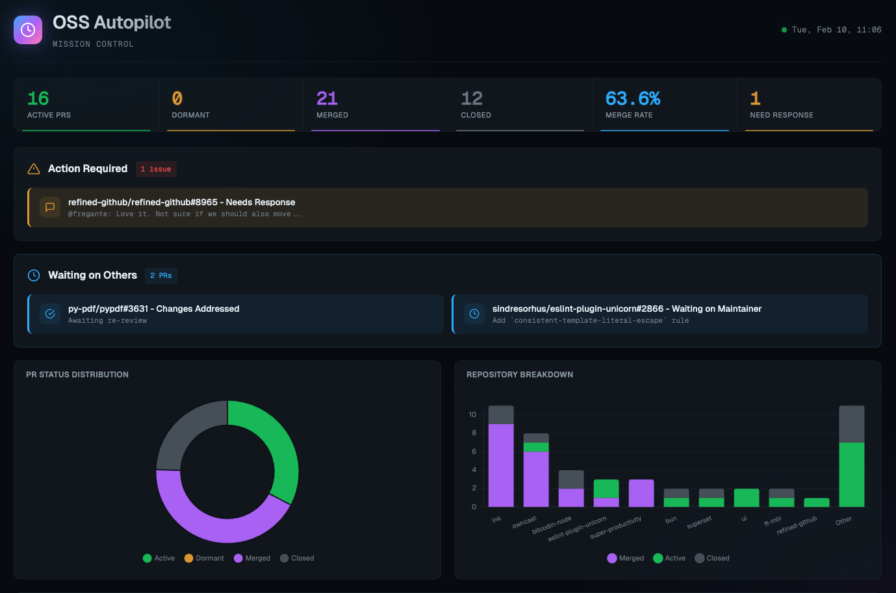

# OSS Autopilot

You have 12 open PRs across GitHub. A maintainer asked a question 5 days ago. Two PRs have failing CI you haven't noticed. And you're about to open another one.

**Sound familiar?**

OSS Autopilot is an AI copilot that tracks all your open source PRs, alerts you when something needs attention, and helps you respond to maintainer feedback so your contributions actually get merged.


[](https://www.npmjs.com/package/oss-autopilot)




## Install in 60 Seconds

**Prerequisites:** [Claude Code](https://claude.ai/claude-code), Node.js 18+, [GitHub CLI](https://cli.github.com/) (`gh auth login`)

```
/plugin marketplace add costajohnt/oss-autopilot
/plugin install oss-autopilot@oss-autopilot
```

Restart Claude Code, then run `/setup-oss`. Done.

## What Happens When You Run `/oss`

Claude checks every open PR you have across all of GitHub and tells you what needs your attention:

```
📊 15 Active PRs | 2 need attention | Dashboard opened in browser | v0.25.1

2 PRs Need Attention (in priority order):

1. [Needs Response] vadimdemedes/ink#855 - Add kitty keyboard support (3d)
   └─ @sindresorhus: tests requested
   └─ Effort: Medium - respond + add tests

2. [CI Failing] rubyforgood/human-essentials#5492 - Add item filter (1d)
   └─ Failing: rspec, lint
   └─ Effort: Medium - investigate CI logs

What would you like to do?
  > Work through all 2 issues (Recommended)
  > Search for new issues
  > Done for now
```

Then Claude walks you through each issue: drafting responses, diagnosing CI failures, resolving conflicts, until everything is handled.

An HTML dashboard also opens in your browser with charts showing your contribution timeline, merge rate, and PR health at a glance.

### When You Search for Issues

Select "Search for new issues" and the issue scout finds opportunities matched to your history — not just random "good first issue" results:

```
🔍 Found 8 candidates across 6 repos

From repos where you've merged PRs ⭐
─────────────────────────────────────
1. ✅ expressjs/express#6012 — Add timeout option to res.download()
   Labels: feature, good first issue
   Score: 92/100 — You merged 2 PRs here, clear requirements, active repo
   ✓ unclaimed · ✓ no linked PRs · ✓ last commit 2 days ago

2. ✅ chalk/chalk#642 — Support NO_COLOR in browser builds
   Labels: enhancement
   Score: 85/100 — You merged 1 PR here, repo has 7-day merge time
   ✓ unclaimed · ✓ no linked PRs · ✓ CONTRIBUTING.md found

From your starred repos
─────────────────────────────────────
3. ✅ sindresorhus/execa#831 — Add encoding option to execaNode
   Labels: good first issue, help wanted
   Score: 78/100 — High-quality repo, clear requirements, recent activity
   ✓ unclaimed · ✓ no linked PRs · ✓ last commit 5 days ago

Skipped (not worth your time)
─────────────────────────────────────
⚠ fake-oss/calculator — Label farming detected (6 beginner labels)
⚠ inactive/legacy-app — No commits in 90+ days
⚠ contested/router#44 — Already claimed by @other-dev 2 days ago
```

Each issue gets a **viability score (0-100)** based on your relationship with the repo, issue clarity, project health, and whether someone else has already claimed it. Repos where your PRs got merged are prioritized first — that's where you have the highest chance of getting another PR accepted.

## The Problem

Contributing to open source is rewarding but hard to sustain:

- **PRs go stale** - You forget to check on submissions from weeks ago
- **Comments get missed** - Maintainer feedback sits unanswered, PRs rot
- **No good starting point** - You want to contribute but don't know where
- **Tracking is tedious** - Multiple contributions across repos, each with different status

## How OSS Autopilot Helps

| What it does | How |
|---|---|
| **Monitors all your PRs** | Checks for new comments, CI failures, merge conflicts, incomplete checklists, and maintainer requests |
| **Drafts responses** | Claude reads maintainer feedback and writes a response for your review |
| **Finds issues matched to you** | 3-phase priority search: repos where you've merged PRs first, then starred repos, then general discovery. Scores every issue 0-100 on viability. Filters spam repos, claimed issues, and inactive projects |
| **Scores repositories** | Evaluates merge rate, PR review speed, maintainer responsiveness, and community health. Caches scores and tracks your relationship with each repo |
| **Keeps you honest** | Flags approaching-dormant PRs and capacity limits so nothing slips |
| **Never acts without you** | Human-in-the-loop: nothing is posted to GitHub without your explicit approval |

## Why Not Just Use...?

Existing tools cover pieces of the workflow. None handle the full contribution lifecycle.

| Capability | OSS Autopilot | Issue Finders | PR Dashboards | AI Agents |
|---|:---:|:---:|:---:|:---:|
| Find issues matched to your history | Yes | No | No | No |
| Find issues by label/language | Yes | Yes | No | Some |
| Monitor PR health across repos | Yes | No | Yes | No |
| Diagnose CI failures | Yes | No | No | Some |
| Draft responses to maintainers | Yes | No | No | Yes |
| Learn from your merge history | Yes | No | No | No |
| Repository health scoring | Yes | No | No | No |
| Track issue discussions | Yes | No | No | No |
| Human-in-the-loop | Yes | n/a | n/a | Rarely |
| Free & local | Yes | Some | No | No |

**Issue finders** help you discover projects but show the same results to everyone. They don't know your merge history, can't filter spam repos, and abandon you after the search. **PR dashboards** (Graphite, $24/mo) are built for teams, not individual contributors. **AI agents** can write code but don't manage the social side of OSS. OSS Autopilot covers discovery, monitoring, diagnosis, and response in one workflow — and learns from your history to get better over time.

---

## Usage

### Daily Workflow (5 min)

1. Run `/oss` to see what needs attention
2. Work through critical issues (CI failures, maintainer comments, conflicts)
3. Done for now

### Finding Contributions (15 min)

1. Run `/oss` and select "Search for new issues"
2. The issue scout searches in priority order:
   - **Repos where you've merged PRs** (highest success rate — no "good first issue" filter needed)
   - **Your starred repos** (you already expressed interest)
   - **General GitHub discovery** (language + label filters, minimum star count)
3. Each issue is vetted automatically — existing PRs, claim comments, project activity, contribution guidelines
4. Pick a high-scoring issue, and Claude drafts a professional claim message for your review

Issues from spam repos (label farming, templated mass issues) and inactive projects are filtered before you ever see them.

### Responding to Feedback (10 min)

1. Run `/oss` to see PRs with new comments
2. Select a PR that needs a response
3. Claude reads the feedback and drafts a response for your review
4. Post it after reviewing

### Dashboard

The dashboard (`~/.oss-autopilot/dashboard.html`) auto-opens each time you run `/oss`. It includes:



- **Status Overview** - Doughnut chart of PR states (active, merged, closed, dormant)
- **Repository Breakdown** - Top 10 repos by total PRs with stacked bars
- **Contribution Timeline** - Monthly view of PRs opened, merged, and closed

### Curated Issue Lists

Maintain a markdown file of issues you're interested in. `/oss` detects it and offers "Pick from issue list" as an action. Completed issues get marked done automatically.

Configure the path in `/setup-oss`, or place a file at `open-source/potential-issue-list.md`, `oss/issue-list.md`, or `issues.md`.

### Specialized Agents

Claude automatically dispatches these based on context:

| Agent | Purpose | When it runs |
|-------|---------|-------------|
| **pr-responder** | Drafts responses to maintainer feedback | PR has `needs_response` status (unread maintainer comment) |
| **pr-health-checker** | Diagnoses CI failures, merge conflicts, stale reviews | PR has `failing_ci`, `merge_conflict`, or needs rebase |
| **pr-compliance-checker** | Validates PRs against [opensource.guide](https://opensource.guide) best practices | Before marking a new PR as ready for review |
| **pre-commit-reviewer** | Reviews code changes before committing | After Tier 2 code changes, before commit/push |
| **issue-scout** | Finds and vets new issues to work on | User selects "Search for new issues" from action menu |
| **repo-evaluator** | Analyzes repository health before contributing | Before claiming an issue in an unfamiliar repo |
| **contribution-strategist** | Strategic advice for your OSS journey | User asks for contribution strategy or career advice |

### Available Commands

| Command | Description |
|---------|-------------|
| `/oss` | Check your PRs, see what needs attention, take action |
| `/setup-oss` | Configure preferences and import existing PRs |

---

## Configuration

Settings live in `.claude/oss-autopilot/config.md` (YAML frontmatter). Run `/setup-oss` to configure interactively, or edit directly:

| Setting | Default | Description |
|---------|---------|-------------|
| `githubUsername` | (detected) | Your GitHub username |
| `maxActivePRs` | 10 | Capacity limit before suggesting focus |
| `dormantDays` | 30 | Days until PR marked dormant |
| `approachingDormantDays` | 25 | Days until dormancy warning |
| `languages` | (chosen at setup) | Languages to filter issue search |
| `labels` | (chosen at setup) | Issue labels to search for |
| `showHealthCheck` | `true` | Show PR health notification on session start |

PR tracking state is stored separately in `~/.oss-autopilot/state.json`.

## Tips

**Start small:** Set `maxActivePRs` to 3-5 when starting out. Fewer active PRs with fast responses beats many stale ones.

**Check in regularly:** Run `/oss` every few days. Stale PRs are hard to revive.

**Trust but verify:** Claude's draft responses are good starting points. You know the technical context better.

**Evaluate repos first:** Before claiming an issue, let the repo-evaluator check if the project is actively maintained and responsive to external contributors.

---

## Updating

```
/plugin marketplace update oss-autopilot
```

Your configuration is preserved. The CLI bundle auto-rebuilds after upgrades. See the [Changelog](CHANGELOG.md) for what's new.

---

## How It Works

OSS Autopilot uses a hybrid architecture: deterministic TypeScript for speed and reliability, Claude for judgment and communication.

```
┌─────────────────────────────────────────────────┐
│  Claude Code Plugin Layer                       │
│  - /oss and /setup-oss commands                 │
│  - 7 specialized agents for different tasks     │
│  - Pre-commit hooks enforcing workflow rules    │
│  - Contribution best-practice skills            │
├─────────────────────────────────────────────────┤
│  TypeScript CLI (deterministic, fast)           │
│  - Fetches all open PRs from GitHub Search API  │
│  - Outputs structured JSON for Claude to parse  │
│  - Generates HTML dashboard                     │
├─────────────────────────────────────────────────┤
│  Core Logic (tested, type-safe)                 │
│  - State management with auto-backups           │
│  - PR health monitoring and status detection    │
│  - Capacity assessment                          │
└─────────────────────────────────────────────────┘
```

The CLI supports `--json` on every command for structured output:

```bash
# Run via the plugin (normal usage)
/oss

# Run CLI directly (scripting / debugging)
GITHUB_TOKEN=$(gh auth token) node dist/cli.bundle.cjs daily --json
GITHUB_TOKEN=$(gh auth token) node dist/cli.bundle.cjs search 10 --json
node dist/cli.bundle.cjs status --json
node dist/cli.bundle.cjs dashboard
```

All commands return `{ success, data, error, timestamp }`, useful for building your own tooling on top.

---

## Development

```bash
git clone https://github.com/costajohnt/oss-autopilot.git
cd oss-autopilot
npm install
npm test                    # Run all tests (vitest)
npm start -- daily --json   # Run CLI via tsx (no bundle needed)
```

Test as a local plugin:

```bash
claude --plugin-dir ./oss-autopilot
```

### Pre-commit Hooks

| Hook | What it blocks |
|------|----------------|
| `check-versions.sh` | Commits when `package.json`, `plugin.json`, and README badge versions don't match |
| `no-ai-attribution.sh` | Commits containing AI attribution phrases |
| `no-commit-on-main.sh` | Direct commits to `main` or `master` |
| `conventional-commits.sh` | Commit messages without `feat:`/`fix:`/`chore:` prefix |

---

## Troubleshooting

<details>
<summary>GitHub CLI authentication errors</summary>

```
Error: gh: command not found
```

Install [GitHub CLI](https://cli.github.com/) and authenticate:

```bash
brew install gh    # macOS
gh auth login
```
</details>

<details>
<summary>Build fails on first run</summary>

The CLI bundles automatically on first use. If it fails:

```bash
# Find your plugin directory
find ~/.claude/plugins -name "oss-autopilot" -type d

# Rebuild
cd <path-from-find-command>
npm install
npm run bundle
```
</details>

<details>
<summary>Dashboard doesn't open</summary>

The dashboard is at `~/.oss-autopilot/dashboard.html`. If it doesn't open automatically, open it manually in your browser.
</details>

<details>
<summary>PRs not showing up</summary>

- Run `/setup-oss` to ensure your GitHub username is configured
- Check that `gh auth status` shows you're authenticated
- The plugin only tracks PRs you authored
</details>

---

## FAQ

**Does Claude post comments or push code automatically?**
No. Claude drafts responses and suggests actions. Nothing is posted to GitHub without your explicit approval.

**Where is my data stored?**
Config in `.claude/oss-autopilot/config.md`. State and dashboard in `~/.oss-autopilot/`. Nothing is sent to external servers beyond GitHub API calls to fetch your PR data.

**Does it work with private repos?**
Yes, as long as your GitHub CLI (`gh`) has access.

**Can I use this without Claude Code?**
The CLI can run standalone (`node dist/cli.bundle.cjs daily --json`), but it's designed for the Claude Code plugin experience.

**GitLab / Gitea / Bitbucket support?**
Not yet — see [Limitations](#limitations) below.

## Limitations

- **GitHub only** — GitLab, Bitbucket, and other forges are not supported. Contributions welcome.
- **1,000 PR cap** — GitHub's Search API returns at most 1,000 results per query. If you have more than 1,000 open, merged, or closed PRs, the oldest results from each search may be truncated.
- **Rate limiting** — The CLI automatically backs off on GitHub rate limits (with up to 2 retries) and secondary rate limits (1 retry), but sustained heavy use can exhaust these retries. If this happens, wait a few minutes and retry.
- **Individual contributor focus** — Designed for solo contributors managing their own PRs. No team dashboards, shared state, or multi-user workflows.

---

## Contributing

Bug fixes, new agents, CLI improvements, and documentation are all welcome. See [CONTRIBUTING.md](CONTRIBUTING.md) for setup instructions.

## License

MIT
