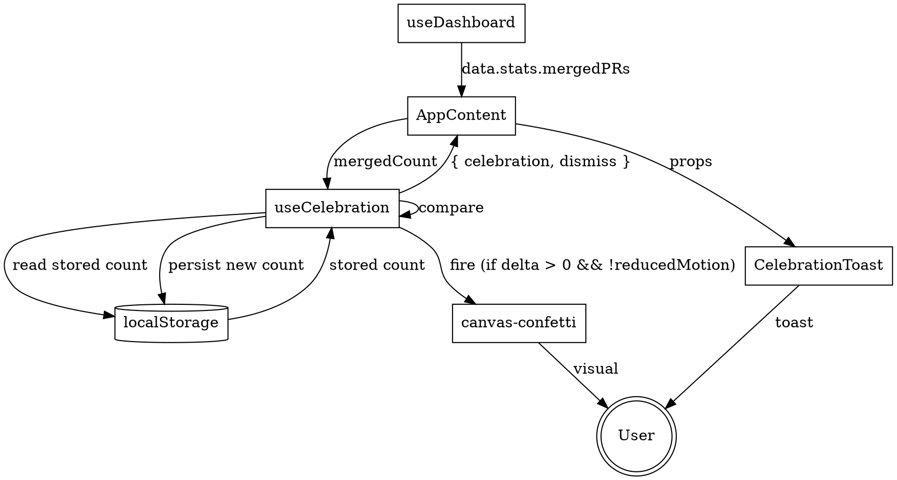

# Celebration animation when new PRs are merged

**Issue:** costajohnt/oss-autopilot#923
**Date:** 2026-04-10
**Status:** Approved, ready for implementation plan

## Summary

When the dashboard detects that the all-time merged PR count has increased since
the last page load, fire a celebratory confetti animation and show a toast that
says "N new PRs merged. Great work!" The toast auto-dismisses after five seconds
but can also be dismissed manually. First-time loads (no previously stored count)
do not celebrate — they just seed the stored count silently.

This reinforces the dashboard's existing gamification loop (merge rates, status
breakdowns, streaks) with a moment of positive feedback at the exact point the
work pays off.

## Scope decisions (resolved during brainstorming)

| Question                      | Decision                                                            |
| ----------------------------- | ------------------------------------------------------------------- |
| What counts as a "new merge"? | Simple delta on `stats.mergedPRs`. No per-URL tracking.             |
| Animation library             | `canvas-confetti` (~8KB gzipped). Built-in fireworks preset.        |
| User-facing toggle            | None in v1. `prefers-reduced-motion` is the only opt-out.           |
| Toast system                  | One-off component for this feature. Not a reusable toast framework. |
| Settings UI                   | Deferred. No settings panel exists in the dashboard today.          |

## Architecture

Three net-new pieces, all inside `packages/dashboard/src`:

### 1. `hooks/use-celebration.ts` (new)

Custom Preact hook that owns the celebration state machine.

**Signature:**

```ts
interface Celebration {
  message: string;
  id: number; // Date.now() — enables re-triggering the dismiss timer
}

function useCelebration(mergedCount: number | undefined): {
  celebration: Celebration | null;
  dismiss: () => void;
};
```

**Behavior:**

- Reads `localStorage['oss-autopilot-merged-count']` on every change to
  `mergedCount`. Pattern mirrors `use-theme.ts`: `STORAGE_KEY` constant, try/catch
  with `console.warn` on failure, graceful fallback.
- Cases (evaluated in order, inside a single `useEffect` keyed on `mergedCount`):
  1. `mergedCount === undefined` → no-op. (Data hasn't loaded.)
  2. **No stored count** → persist `mergedCount`, do not celebrate. First-time
     load path.
  3. **Stored count === new count** → no-op.
  4. **New count > stored count** → compute `delta = new - stored`, build
     message (`"1 new PR merged. Great work!"` when `delta === 1`, else
     `"${delta} new PRs merged. Great work!"`), fire confetti (unless reduced
     motion), set `celebration` state, persist new count.
  5. **New count < stored count** → silently persist new (lower) count.
     No celebration. Handles the rare PR-deletion / count-drift case.
- Reduced-motion check: `window.matchMedia('(prefers-reduced-motion: reduce)').matches`.
  If true, **skip confetti entirely** but still set the toast state. The global
  CSS reduced-motion rule does not cover canvas animations, so this must be an
  explicit check.
- `dismiss` sets `celebration` back to `null`.

**Storage key:** `oss-autopilot-merged-count` (matches `oss-autopilot-theme`
naming convention).

### 2. `components/celebration-toast.tsx` (new)

Thin presentational component. Renders `null` when `celebration` is `null`.
When present, renders a fixed-position toast with the message and a dismiss
button.

**Signature:**

```tsx
interface CelebrationToastProps {
  celebration: Celebration | null;
  onDismiss: () => void;
}
```

**Behavior:**

- Auto-dismisses after 5 seconds via `useEffect` + `setTimeout`. The effect
  keys on `celebration?.id`, so a second celebration that arrives before the
  first has dismissed will reset the timer cleanly.
- Accessibility: `role="status"`, `aria-live="polite"`, dismiss button has
  `aria-label="Dismiss celebration"` and is keyboard-focusable.

### 3. `canvas-confetti` dependency

Added to `packages/dashboard/package.json` dependencies. Imported at the top of
`use-celebration.ts`. The fireworks show is ~15 lines of imperative setup
(stacked bursts on a timer using the `confetti()` function).

## Data flow



## Timing — why this is non-obvious

The existing `useDashboard` hook does two fetches on every page load:

1. **Initial fetch** of cached data (`GET /api/data`) when the component mounts.
2. **Silent refresh** of fresh data (`POST /api/refresh`) 5 seconds later.

Both fetches update `data.stats.mergedPRs`, which means `useCelebration` will
run twice on every page load. The state machine above must handle this
correctly:

- **Page load, nothing new:** run 1 seeds/confirms the stored count, run 2 is a
  no-op. No celebration. ✅
- **Page load, PR merged between visits (cached data already reflects it):**
  run 1 detects the delta and celebrates, run 2 is a no-op. ✅
- **Page load, PR merged while the page was open (silent refresh picks it up):**
  run 1 confirms stored count, run 2 detects the delta and celebrates. ✅
- **Fresh install (no stored count):** run 1 seeds, run 2 is a no-op. No
  celebration. ✅ (Satisfies the issue's "first-time load should not trigger"
  requirement.)

The key invariant: **we persist the new count on every run where the count has
changed**, not only when we celebrate. That's what makes run 2 a no-op in the
normal case.

## Styling

New CSS block in `packages/dashboard/src/styles.css`, placed near the other
animation-related rules.

- Fixed position, top-right, 24px from edges.
- Pill shape (border-radius ~999px), 12px vertical / 20px horizontal padding.
- Background: `var(--purple)` (matches the merged-count color in the header
  stats bar — visual continuity with the thing being celebrated).
- White text, medium weight.
- Subtle box-shadow: `0 8px 24px rgba(0,0,0,0.2)`.
- Enters via the existing `fadeInUp` keyframe (0.5s).
- Exits via a simple opacity transition on unmount.
- No new `@keyframes` blocks needed.

## Accessibility

- **Screen readers:** `role="status"` + `aria-live="polite"` announces the
  toast without interrupting other speech.
- **Reduced motion:** explicit `matchMedia('(prefers-reduced-motion: reduce)')`
  check skips confetti entirely. Toast still shows (flattened to ~instant by
  the global reduced-motion CSS rule at `styles.css:1856`).
- **Keyboard:** dismiss button is a real `<button>` with an `aria-label`,
  natively focusable.
- **Color contrast:** white text on `var(--purple)` meets WCAG AA in both
  light and dark themes (verified manually — `--purple` is the same value
  used for high-contrast header stats today).

## Testing

### Unit tests

**`hooks/use-celebration.test.ts`** — `vitest` + `@testing-library/preact`
`renderHook`. Mocks:

- `vi.mock('canvas-confetti', () => ({ default: vi.fn() }))`
- `localStorage` via direct manipulation (same pattern as
  `use-theme.test.ts:51`).
- `window.matchMedia` stub for the reduced-motion case.

Cases:

1. First load with no stored count → does not celebrate, persists count.
2. Load with matching stored count → does not celebrate, no storage write.
3. Load with higher stored count → celebrates with `delta = 1` message,
   persists new count, calls confetti mock.
4. Load with delta > 1 → message contains the correct delta.
5. Load with lower count (regression) → does not celebrate, silently persists
   new count.
6. Reduced motion preference set → sets celebration state but does NOT call
   confetti mock.
7. `localStorage.getItem` throws → does not celebrate (safe fallback), does
   not crash.
8. `localStorage.setItem` throws → does not crash.
9. `dismiss()` clears the celebration state.

**`components/celebration-toast.test.tsx`** — renders, dismisses, auto-dismisses.

- Renders the message when `celebration` is non-null.
- Renders nothing when `celebration` is null.
- Clicking the dismiss button calls `onDismiss`.
- Auto-dismisses after 5s via `vi.useFakeTimers` + `vi.advanceTimersByTime`.
- A new celebration arriving before the first dismisses resets the timer
  (key-on-id behavior).
- Has `role="status"` and `aria-live="polite"`.

### Integration

No changes to `app.test.tsx`. The unit tests cover the interesting behavior and
the wire-up in `AppContent` is a two-liner that doesn't warrant a full-app
integration test.

## File manifest

**New files:**

- `packages/dashboard/src/hooks/use-celebration.ts`
- `packages/dashboard/src/hooks/use-celebration.test.ts`
- `packages/dashboard/src/components/celebration-toast.tsx`
- `packages/dashboard/src/components/celebration-toast.test.tsx`

**Modified files:**

- `packages/dashboard/package.json` — add `canvas-confetti` to `dependencies`,
  add `@types/canvas-confetti` to `devDependencies`.
- `packages/dashboard/src/app.tsx` — call `useCelebration(data?.stats.mergedPRs)`
  inside `AppContent`, render `<CelebrationToast>` inside `<main>`.
- `packages/dashboard/src/styles.css` — new `.celebration-toast` CSS block.
- `pnpm-lock.yaml` — lockfile update from the `canvas-confetti` install.

## Out of scope (explicit non-goals)

- Per-PR detection / showing merged PR titles in the toast. Resolved to
  count-delta-only during brainstorming.
- User-facing toggle or settings UI. Deferred. Reduced-motion handles the
  accessibility opt-out.
- Server-side event stream for merge detection. The existing fetch/refresh
  cycle is sufficient.
- Celebration for other milestones (first merge ever, 10th merge, etc). Future
  enhancement.
- Sound effects. Intentionally omitted — audio without a user gesture is
  usually blocked and is far more disruptive than visuals.

## Risks

- **`canvas-confetti` bundle impact** — ~8KB gzipped. Justified by the feature
  (per feedback memory on bundle size). Chart.js is already ~60KB, so this is
  a rounding error.
- **Multiple tabs** — if the user opens two dashboard tabs, both will read the
  same `localStorage` value. Whichever tab refreshes first will celebrate;
  the second tab will no-op because the stored count is now current. This is
  acceptable — the user is notified exactly once, which is the right behavior.
- **State sync across machines** — the stored count is local to one browser.
  A user on a new machine will see their first refresh as "first load" and
  won't celebrate historical merges. This is expected and correct.
